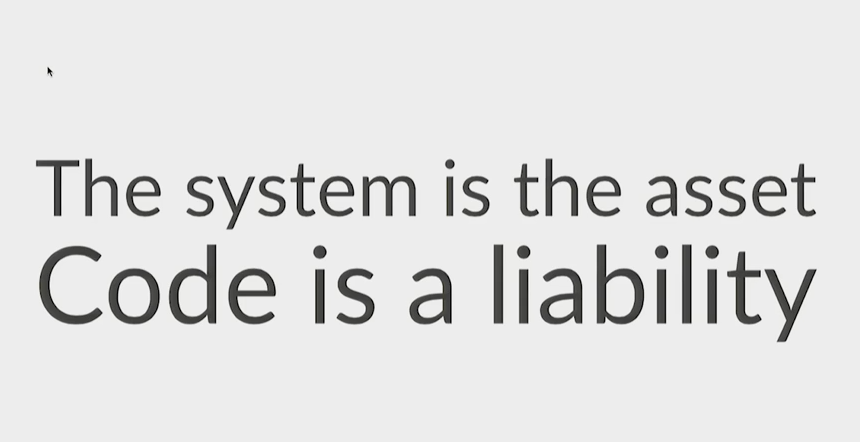
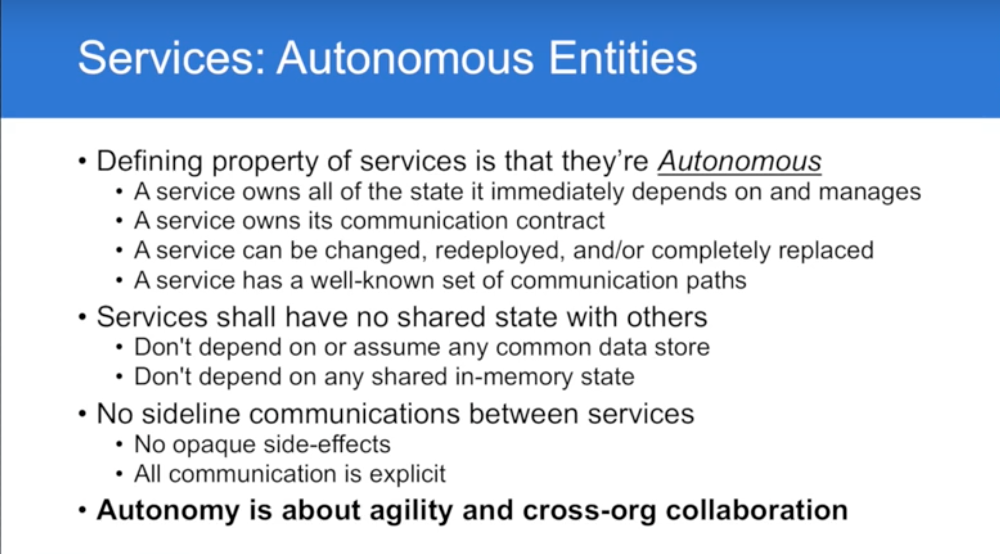
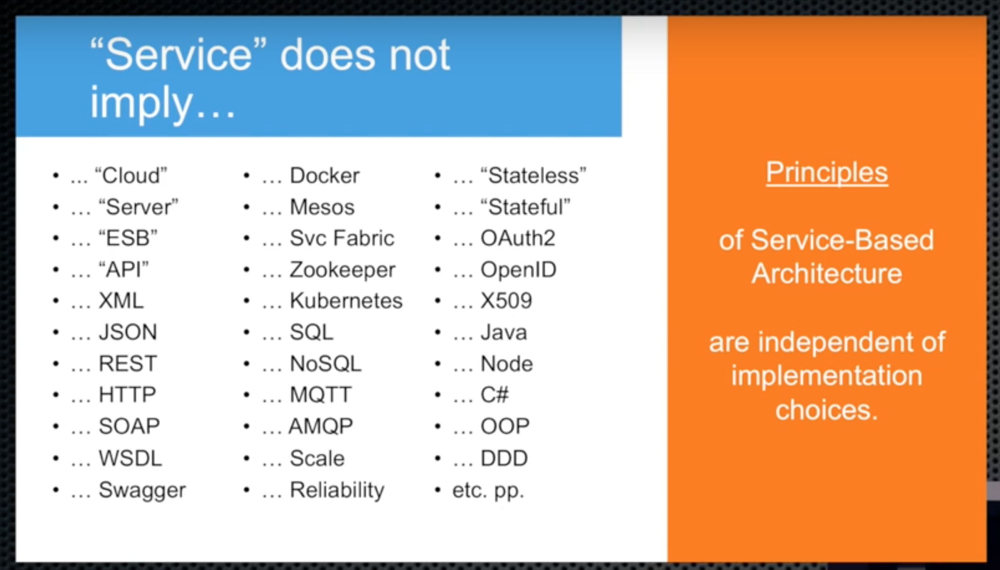
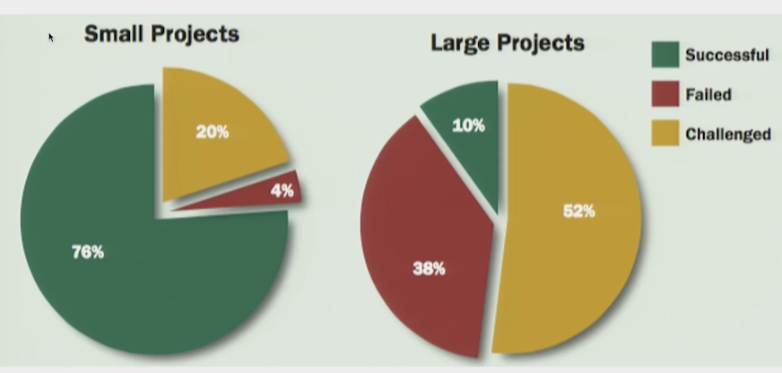

# Services 101

# It's all about Coupling.

Eric Evans [DDD & Microservices: At Last, Some Boundaries!](https://www.youtube.com/watch?v=yPvef9R3k-M&index=18&list=PLinPBP3n4t5t9R7zF1fR8Ck3G3dC9BOmr)

Services (microservices) kao rjesenje ...?

# Code is a liability

# Services definition (~2004)

services are

services are not

# Small vs large

... kako 'prodavati' services

# Paterns 

(nuzno da bi services arhitektura uspjela):

Central/common:
 
* communication patterns
  * sync
  * async 
* service discovery
* deployment system
* logging 
* monitoring system 

# Antipaterns 

(micorservice can go wrong):

* consistency (vs eventual consistency)
* synchronous communication
* shared libraries
* shared database

# Resources

Youtube [Arhitecture](https://www.youtube.com/playlist?list=PLinPBP3n4t5t9R7zF1fR8Ck3G3dC9BOmr) playlist

tldr; 
Chad Fowler: [Kill "Microservices" before its too late](https://youtu.be/-UKEPd2ipEk?t=49)
Clemes Vasters: [Messaging and Microservices](https://www.youtube.com/watch?v=rXi5CLjIQ9k)

