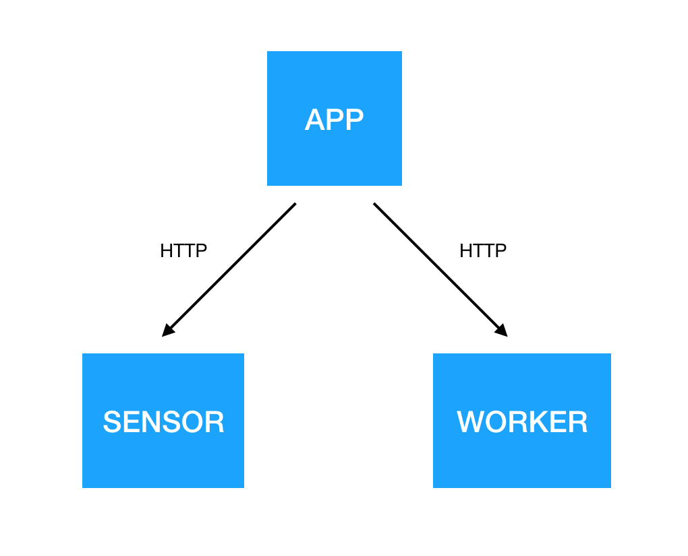

# Services communicate over HTTP

System consists of three services:

- [sensor](./sensor) generates random numbers and serves them on HTTP interface
- [worker](./worker) exposes HTTP interface for adding numbers
- [app](./app) reads values from sensor every second, sends them to worker and stores the results to log.



### Requirements

- [ruby](https://github.com/rbenv/rbenv)
- [thor](https://github.com/erikhuda/thor)
- [golang](https://golang.org/doc/install)
- [goreman](https://github.com/mattn/goreman)

### Running

```
./build.rb binary_all
goreman start
```
