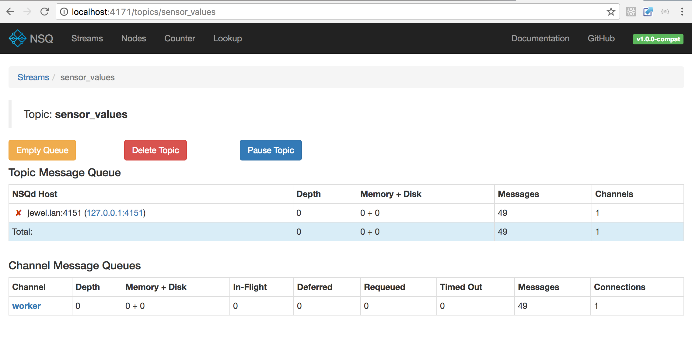

# Services that communicate over NSQ

Services from [previous example](../01-http/) are adapted to communicate over [NSQ](http://nsq.io/).


### Requirements

- [ruby](https://github.com/rbenv/rbenv)
- [thor](https://github.com/erikhuda/thor)
- [golang](https://golang.org/doc/install)
- [goreman](https://github.com/mattn/goreman)
- [go-nsq](https://github.com/nsqio/go-nsq)
- [nsq](http://nsq.io/deployment/installing.html)

### Running

```
./build.rb binary_all
goreman start
```

When example is started *nsqadmin* web interface is available on <http://localhost:4171/>.



Messages from some topic can be traced in terminal by running *nsq_tail* tool (included in *nsq* installation):

```
nsq_tail -lookupd-http-address=127.0.0.1:4161 -topic sensor_values
```

Nice example of load-balancing can be achieved by running another `Worker` process in terminal:

```
./worker/worker
```