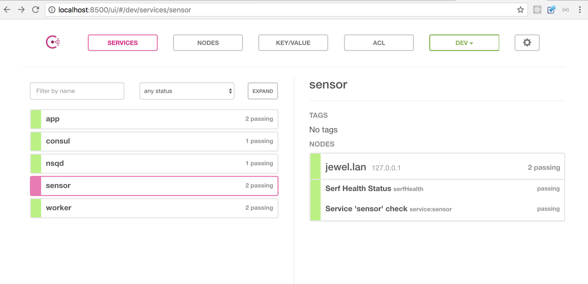
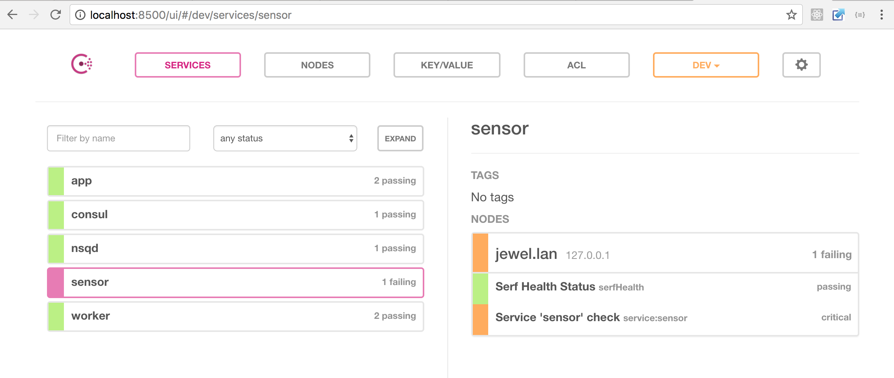

# Service discovery by Consul

This example adds [Consul](https://www.consul.io/) to the [previous setup](../02-nsq/).

Services are not connecting to *nsqd* directly anymore. They resolve location of *nsqd* by asking Consul. Also, each service exposes its */health_check* interface for Consul to poll. 

### Requirements

- [ruby](https://github.com/rbenv/rbenv)
- [thor](https://github.com/erikhuda/thor)
- [golang](https://golang.org/doc/install)
- [goreman](https://github.com/mattn/goreman)
- [go-nsq](https://github.com/nsqio/go-nsq)
- [nsq](http://nsq.io/deployment/installing.html)
- [consul](https://www.consul.io/)

### Running

```
./build.rb binary_all
goreman start
```

When example is started *consul* web interface is available on <http://localhost:8500/>:



If something unexpected happens to some service Consul will detect that on service *health_check*:

```
goreman run stop sensor
```



Some Consul rest API queries:

- list of registered services <http://localhost:8500/v1/catalog/services>
- service information <http://localhost:8500/v1/catalog/service/nsqd>
- service *health_check* <http://localhost:8500/v1/health/checks/sensor>
