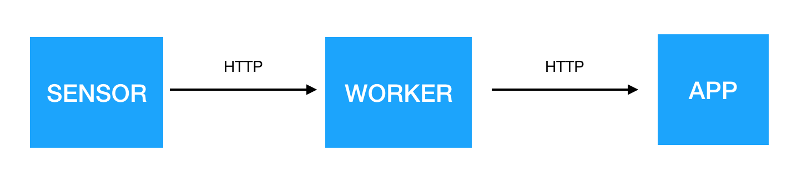
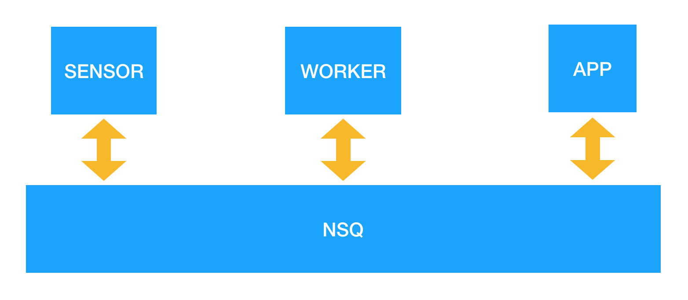
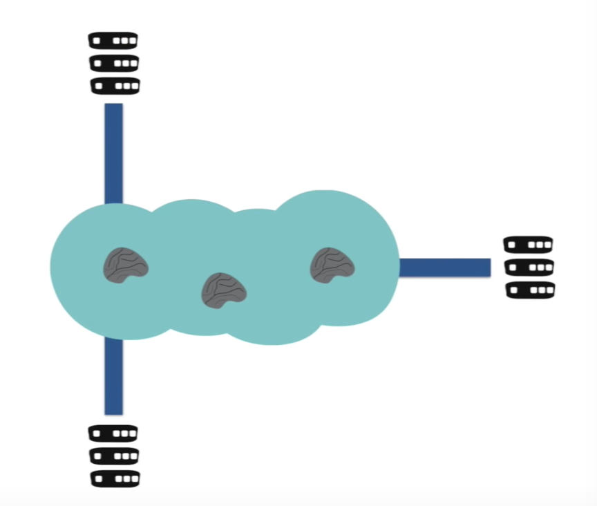
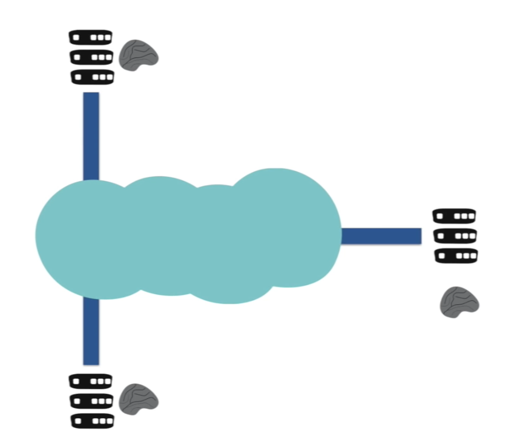

# Microservices in production: a case study

Microservices - also known as the microservice architecture - is an architectural style that structures an application as a collection of loosely coupled services, which implement business capabilities. The microservice architecture enables the continuous delivery/deployment of large, complex applications. It also enables an organisation to evolve its technology stack (description from [microservices.io](http://microservices.io/)).

This description doesn't give much detail on HOW to do it. Even more so, the people who have done it have all done it **in their specific way** using different tools and different environments. There are no frameworks for doing microservices. There are plenty of tools to help you along the way and yet none of them are required.  There are patterns for solving some known problems. There are lists of good/bad practices and tons of advice. So you have to choose carefully to suit your own needs. With all of this it is highly likely for one setup to end up unique in many of its aspects.

# The case studied

In a similar way, the setup we present here is just a single solution. It has been working with significant load in production for some time now. And that is the message this post will try to deliver: to show some details of a **single solution that works in production**.

[SuperSport](https://www.supersport.hr/) is the largest betting company in Croatia (20TB monthly data transfer, 9M monthly business transactions). It started 12 years ago with several bet-shops. It was the first company in Croatia to introduce betting machines in public places (10 years ago) and also the first one to introduce online betting on the first day it became legally possible (7 years ago). Today SuperSport holds the dominant position in the betting industry in Croatia. 

The intention of this post is to show some technical aspects of the system as it stands today. To be more specific, I will describe how we adopted the system to the microservice architecture. 

To do so I will start with very basic example and gradualy upgrade it until we reach the final setup that is very much alike the one we use in production. Feel free to start the examples localy on your machine and to take a look at the source code:

1. [services communicating using rest](https://github.com/minus5/examples-services/tree/master/01-http),
- [introducing messaging](https://github.com/minus5/examples-services/tree/master/02-nsq) (NSQ),
- [introducing service discovery](https://github.com/minus5/examples-services/tree/master/03-consul) (Consul) and
- [introducing containerization](https://github.com/minus5/examples-services/tree/master/04-docker) (Docker)


# Example 1: REST

We start with dummy system which consists of 3 services: `Sensor`, `Worker` and `App` ([example 1](https://github.com/minus5/examples-services/tree/master/01-http)).


`Sensor` generates random numbers and exposes them at HTTP interface. 

`Worker` is able to recieve some sensor data ad perform some heavy computation on it. In this showcase it only squares received numbers and returns them as a result. It also exposes this functionality on HTTP interface.

`App` orchestrates the whole process. It asks `Sensor` for some data, sends the data to the `Worker`, receives the result and writes it to log. 

## Building and running

We should be able to build and start the whole system as easy as with single monolith application. In system with multiple services you should have **automated building and running**; without it development process tends to become slow and painful.

We can start our example by separately building and starting each service. For example, to build and run `Sensor` one sholud do:

```
$ cd ./01-http/sensor
$ go build
$ ./sensor
Started sensor at http://localhost:9001.
```

Since the procedure is similar for each service we can automate it. To do so we write a simple *Ruby* script (using [thor](https://github.com/erikhuda/thor) task runner):

```
desc "binary", "Build single go binary"
def binary(name)
  puts "#{name}: building binary"
  path_cmd(name, "go build")
end

desc "binary_all", "Build all go binaries"
def binary_all()
  binary('sensor')
  binary('worker')
  binary('app')
end
```

We use another task runner ([goreman](https://github.com/mattn/goreman)) to run and stop all the services at the same time. We instruct *goreman* which services to run by listing them in the [Procfile](https://github.com/minus5/examples-services/blob/master/01-http/Procfile):

```
sensor: ./sensor/sensor 2>&1 
worker: ./worker/worker 2>&1 
app: ./app/app 2>&1
```

Now we are able to build and start (and stop) everything with two commands:

```
./build.rb binary_all
goreman start
```

## Orchestration

In given example `App` has the responsibility of process **orchestration** by leading it through series of actions:

- initiating the process every second
- asking the `Sensor` for new data
- asking the `Worker` to perform calculations
- logging the result to log

Very important aspect of the orchestrator is that it concentrates the overal **process workflow** on **single place**: in its source code. That source code resembles pseudo code with its actions delegated further to other services.

## REST: second attempt

`App` initiates the cycle every second with hope that there is some new data available on `Sensor`. If the data is unevenly distrubuted throuh time (it almost always is) it could emit ten events in one second and than have a period of silence several minutes long. It would be much better to push the data from `Sensor` to `App` the second it becomes available.

For that purpose we might try to rearrange the layout to allow `Sensor` to initiate the the process. In that case the workflow might look like this:

- data becomes available on `Sensor`
- `Sensor` sends the data to `Worker`
- `Worker` crunches the data and sends the result to `App`
- `App` logs the result



This layout has some significant improvents: 

- it starts to work instantly when the data is available on `Sensor`
- it works only when there is data available

However, this layout is in many aspects a step backwards:

- `Sensor` has now become aware that there are other services in the system (introduced **coupling**)
- `Sensor` has become responsible to deliver the data to the *worker*
- the **overal workflow** of the system **is scattered around** number of services

# Example 2: Messaging (NSQ)

In the [second example](https://github.com/minus5/examples-services/tree/master/02-nsq) we replace HTTP communication with **asynchronous messaging**. Every microservice attaches itself to the message queueing service and uses it as its only interface to other system components. In our system we are using [NSQ](http://nsq.io) distributed messaging system. 



Services are not in any way aware of other services in the system. For that reason message producers are unable to choose which service should receive messages being send. Instead they use various **routing** algorithms.

Message routing in NSQ is organized around *topics* and *channels*:

- publisher pushes the message to some named **topic** 
- each interested consumer opens his own named **channel** on that topic
- every channel will receive a copy of every message published on topic

Routing meshanism we just described is equivalent to classic **pub/sub** mechanism (`Worker` subscribes to `Sensor` messages).

The other common pattern is to distribute messages evenly between several service instances (**load balancing**). For example, if we introduce another instance of `Worker` all messages will be evenly distributed between two of them (image from [NSQ docs](http://nsq.io/overview/design.html)). 


It is important to notice that NSQ routing is not statically configured. It is up to services to decide which topics and chanels to open. 

## Routing antipatterns 

Other message queuing systems support plenty of others routing patterns. However, one should be aware that complex routing algoritms have been recognized as an **antipattern** in microservice architecture. Messaging component should be kept as *dumb* as possible; *smart* parts of tha application shoud be moved to the endpoints ([pictures by Martin Fowler](https://www.youtube.com/watch?v=wgdBVIX9ifA)).




## Distributed messaging

Crucial propery of NSQ is that it is **distributed** system. This prevents it from becoming single point of failure. Basic components of NSQ system are:

- *nsqd* - messaging node
- *nsqlookupd* - discovery node (messaging DNS)
- *nsqadmin* - administration GUI

One can **simoultanously** use mutliple instances of **any** node type. 

When multiple *nsqd* instances are available in the system they should all register at *nsqlookupd*. Publishers can publish messages to any *nsqd* node and to any topic. Consumer sends the topic it is interested in to the *nsqlookupd* and receives a list of *nsqd* nodes that have messages on that topic. After that it connects directly to those *nsqd* nodes.

## Impact of messaging

Messaging has impact on many other aspects of the system:

- decoupling
- event driven design (event sourcing, replay)
- asynchronicity (better support for bursts of data)
- persistence (disaster recovery)
- routing (event broadcast, load balancing)

# Example 3: Service discovery (Consul)

Service discovery is the automatic detection of devices and services on a computer network (description from [wikipedia](https://en.wikipedia.org/wiki/Service_discovery)). In our system we are using [Consul](https://www.consul.io/) for service discovery.

Usually there are some components in the system that are not able to communicate using messaging (databases, key-value storages, proxies, external web services...). Service discovery helps us **locate those services by their name**.

Every service in the system registers itself to Counsul by sending him its:

- name (e.g. *mongodb*)
- location (IP, port)
- *health_check* endpoint

Consul will periodically poll *health_check* endpoint of each registered service and inform other services about any changes in the service infrastucture. 

The only thing that remains to be manually configured within each service is a list of Consul locations; all other infrastructure information is obtained from Consul.

There are several ways to resolve service location via Consul:

- setting up Consul as DNS (query DNS for *mongo.service.sd*)
- polling Consul with HTTP requests
- permanent TCP connection to Consul

It is very common to write wrappers for HTTP requests that will make service discovery by Consul transparent for the developers.

Some other neat features of Consul are:

- alerting (built upon *health_check*)
- leader election
- multi datacenters

Consul-template
---

[Consul-template](https://github.com/hashicorp/consul-template) is a small command-line tool that facilitates configuration of services with current information from Consul. 

For example, to reconfigure *Rails* application with current service locations we can generate its `config.yml` from this Consul template:

```
# excerpt from Rails config.yml
# ask Consul for current location of statsd
{{range service "statsd|passing,warning"}}
  statsd:
    server:    {{.Address}}
    port:      {{.Port}}
{{end}}
```

Within the container that runs this *Rails* application we run `consul-template` as background job:

```
consul-template -template \
  "/templates/config.local.yml:/apps/backend/config.local.yml:touch /apps/backend/tmp/restart.txt"
```

Every change of `statsd` status on Consul will trigger rendering of *config.yml* and graceful restart *Rails* application.

We have been using `consul-template` with various applications, both third party (*haproxy*, *nginx*, *nsq*, *keepalived*) and our custom (*Rails*, *Node*, ...). Within *Go* applications we use our [custom library](https://github.com/minus5/svckit/tree/master/dcy) that maintains constant connection with Consul without need for restarting the service.

# Example 4: Containerization (Docker)

Adding new modules to the monolith application rarely has any impacts on the development environment or on the production infrastucture. We want be able to **instantiate new services** just as easily. That's what Docker is here for.

In [example 4](https://github.com/minus5/examples-services/tree/master/04-docker) we setup our system infrastructure using [Docker](https://www.docker.com/). Each service gets its own docker container with its own OS and environment. Services are deployed to production by instantiating containers on docker hosts. 

Here are some basic terms from Docker ecosystem:

- *Dockerfile* - a receipt for building image
- image - a blueprint for creating containers
- container - image mounted on a Docker host (does the actual work)
- [registry](https://hub.docker.com/_/registry/) - a repository for storing Docker images
- [Docker Hub](https://hub.docker.com/) - public Docker registry

## Dockerfile

*Dockerfile* is a receipt for building single Docker image. For each service (service, worker, app) we define [separate receipt](https://github.com/minus5/examples-services/tree/master/04-docker/images). Here is an example of receipt for our sensor service:

```
FROM gliderlabs/alpine:3.4     # start from existing image (download it from Docker hub)
COPY sensor /bin               # add my binary into image
WORKDIR bin                    # position myself into directory
ENTRYPOINT ["sensor"]          # when starting container start my binary
```

## Docker image

Docker image is created from *Dockerfile* receipt.

```
$ docker build -t sensor .
```

After creating the image we should be able to see it by listing all available images. Here we see that we have locally available alpine and `Sensor` image.

```
$ docker images
REPOSITORY          TAG                 IMAGE ID            CREATED             SIZE
sensor              latest              8d1f3a5ccb5c        5 seconds ago       11.7MB
gliderlabs/alpine   3.4                 bce0a5935f2d        13 days ago         4.81MB
```

## Docker container

Containers are created by mounting images on Docker host:

```
$ docker create sensor
$ dokcer ps -a
CONTAINER ID        IMAGE               COMMAND             CREATED             STATUS              PORTS               NAMES
cad9a64773b3        sensor              "sensor"            47 seconds ago      Created                                 elated_jackson
```

Containers are components that actually run our services. We control (start/stop) Docker containers using Docker CLI.

## Docker Compose

[Docker-compose](https://docs.docker.com/compose/) is a tool that enables you to define a set of containers that should be simoultanously started on a single host. Also, you can define the environment for every container (env variables, open ports, mounted volumes, ...).

In our example we [define](https://github.com/minus5/examples-services/blob/master/04-docker/datacenters/dev/host1/docker-compose.yml) that we want to have separate containers for:

- `Sensor`
- `Worker`
- `App`
- [consul](https://hub.docker.com/_/consul/)
- [nsqd](https://hub.docker.com/r/nsqio/nsq/)
- nsqlookupd
- nsqadmin

It is also worth noting that we already have available Docker images for Consul, nsqd, nsqlookupd and nsqadmin on Docker hub. `Sensor`, `Worker` and `App` are all created from the same [alpine](https://hub.docker.com/_/alpine/) image just by adding different binaries into it.

Now we can start **the whole system** on our local Docker host with **a single command**:

```
docker-compose up
```

## Docker Machine

By using [docker-machine](https://docs.docker.com/machine/) we can execute docker CLI commands on remote hosts.

## Infrastructure as a source

Very important aspect of containerization is that it allows us to have the **complete infrastructure** defined **in source** in a single place (i.e. in a single git repository). 

Our infrastructure is hierarchicaly organized in a tree structure:

- list of **datacenters** (*dev*, *supersport*, *aws*)
- each datacenter has a list of Docker **hosts** 
- each host has a list of running **containers** and their environment (defined by *docker-compose.yml*)

## Continuous integration

In our *dev* datacenter we have several containers that manage the CI process.

**Builder containers** react on every commit to thw source code and build binaries required for creating Docker images. We have separate container for each target technology. For example, *Go* builder builds *Go* binaries, *Rails* buidler precompiles web assets, *JS* builder builds web pages using *Webpack* etc. 

**Image build** puts together prepared binaries with *Dockerfiles*, builds new Docker images, tags them and pushes them to local Docker registry.

**Deployer** listens for remotely dispatched deploy commands and executes them on remote Docker hosts (using *docker-machine* commands). It also commits every change to the infrastructure repository (every deploy is a change in the infrastructure). 

# Summary

