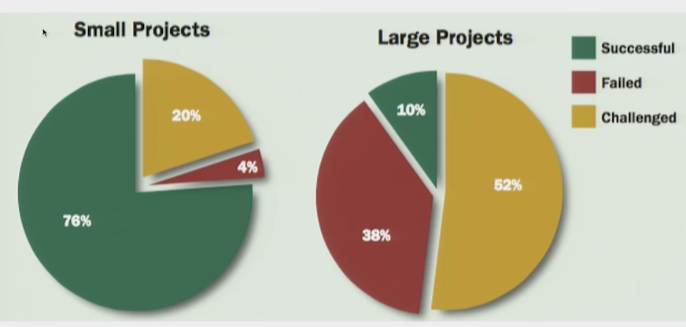
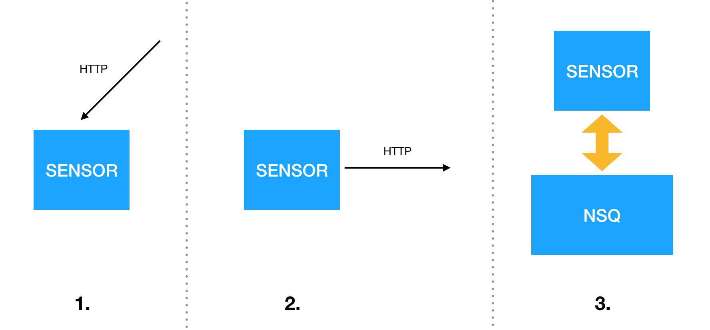

# Microservices in production: a case study

Description of microservices from [microservices.io](microservices.io):

> Microservices - also known as the microservice architecture — is an architectural style that structures an application as a collection of loosely coupled services, which implement business capabilities. The microservice architecture enables the continuous delivery/deployment of large, complex applications. It also enables an organisation to evolve its technology stack.

Description by [Clemens Vasters](https://www.youtube.com/watch?v=rXi5CLjIQ9kon):

> Defining property of services is that they're ***Autonomous***

> - A service owns all of the state it immediately depends on and manages
> - A service owns its communication contract
> - A service can be changed, redeployed, and/or completely replaced
> - A service has a well-known set of communication paths

> Services shall have no shared state with others:

> - Don't depend on or assume any common data store
> - Don't depend on any shared in-memory state

> No sideline communications between services:

> - No opaque side-effects
> - All communication is explicit

> Autonomy is about agility and cross-org collaboration.

> Services does **NOT** imply: Cloud, JSON, HTTP, Docker, SQL, NoSQL, AMQP, Scale, Reliability, Stateless, ...


There are no specific guidelines on HOW to do it. Even more so, the people who have done it have all done it **in their own specific way** using different tools and different environments. There are no frameworks for doing microservices. There are plenty of tools to help you along the way and yet none of them are required.  There are patterns for solving some known problems. There are lists of good/bad practices and tons of advice. So one has to choose carefully to suit his own needs. With all of this it is highly likely for **each setup to end up unique** in many of its aspects.

### A case study

In a similar way, the setup we present here is **a single solution** that has been working with significant load in production for some time now. 

[SuperSport](https://www.supersport.hr/) is the largest betting company in Croatia (20TB monthly data transfer, 9M monthly business transactions). It started 12 years ago with several bet-shops. It was the first company in Croatia to introduce betting machines in public places (10 years ago) and also the first one to introduce online betting on the first day it became legally possible (7 years ago). Today SuperSport holds the dominant position in the betting industry in Croatia. 

The intention of this post is to show some technical aspects of the system as it stands today. 

# Why microservices?

Top reasons for having microservices:

- coupling
- latency
- small vs large project success
- use "the best" tool for the job
- move and release independently
- technical debt

... and many more.

Why not:

- now you have distributed system
- everything is RPC
- what if it breaks
- cost of having many languages (share code, move between teams)
- harder cross-cutting changes (deploy, transitional phases)

[Matt Ranney](https://www.youtube.com/watch?v=kb-m2fasdDY): What I Wish I Had Known Before Scaling Uber to 1000 Services


### Coupling

When change on one component requires changing another it becomes bit harder to achieve. In that sense one component is **coupled** with another. With each coupling introduced it becomes harder and harder to make changes. 

[Greg Young](https://youtu.be/MjIfWe6bn40?t=25m24s):

> If you can't build a monolith what makes you think putting network in the middle will help? 
 
**Isolation** of services is not enforced within monolith. It becomes matter of **developer discipline**. When service boundaries are not explicitly defined they are very likely to be violated. Especially with larger number of developers involved.

Coupling is introduced on various levels:

- module dependencies
- shared data storages (e.g. databases)
- database table references (e.g. foreign keys)
- remote APIs (e.g. HTTP requests)


### Latency

Coupling may bring another side-effect which emerges in production environments: **latency**. Executing database queries on multiple rows/tables within single transaction triggers locking mechanisms which may cut down the overall performance. Microservices usually trade database consistency for **eventual consistency** to improve latency.

[Caitie McCaffrey](https://youtu.be/0UTOLRTwOX0?t=46s) on Distributed Sagas (A Protocol for Coordinating Microservices):

> Once upon a time we used to construct these monolithic applications and they ran on a scale that cloud safely fit inside a single relational database and that was really nice from abstraction point of view because all of the complex logic about consistencies, different consistency models and concurrency models were all handled by single database. We would just horizontally scale our application. Now we are in a time where we can no longer fit in a single database, availability of a single database is no longer sufficient for our customers and for our applications. Driving force is we want availability and to be able to scale beyond single machine. Microservice architecture gives you ability to develop and deploy services by independent teams at faster speeds so we can be more agile. With noSQL databases we have to denormalise our data in our different services so you get higher availability and weaker consistency models.


### Small vs large projects

[Chad Fowler](https://youtu.be/-UKEPd2ipEk?t=29m56s) on success of small vs large projects: 

> "Challenged" means significantly overtime or over budget (to me it sounds like failure). Small projects (most of them) succeed.



### Technical debt

Decoupling of services make **quick-fixes** a bit **harder**. The only interface service has is strictly defined which makes it harder to violate. One service cannot just reach out to another's service data storage; that communication must be explicitly defined. 

From a business point of view it is very nice to have ocasional quick-fix and to leave the actual full-size fixes for later. Such full-size fixes tend to fall out of focus since everything seems to work nicely and there is no evident business reason to do them. This slowly **accumulates technical debt** which can be very harmful for business in the long run.

So there is a cute tradeoff between being able to change things now or later.

# Examples

We will start with a very basic example and gradually upgrade it until we reach a setup very similar to our current production system. Feel free to start the examples locally on your machine and to take a look at the source code:

1. [services communicating using rest](https://github.com/minus5/examples-services/tree/master/01-http),
1. [introducing messaging](https://github.com/minus5/examples-services/tree/master/02-nsq) (NSQ),
1. [introducing service discovery](https://github.com/minus5/examples-services/tree/master/03-consul) (Consul) and
1. [introducing containerisation](https://github.com/minus5/examples-services/tree/master/04-docker) (Docker)


## Example 1: REST

We start with system that has 3 services: `Sensor`, `Worker` and `App` ([source code](https://github.com/minus5/examples-services/tree/master/01-http)).


`Sensor` generates random numbers and exposes them at HTTP interface. 

`Worker` is able to receive some sensor data ad perform some heavy computation on it. In this showcase it only squares received numbers and returns them as a result. It also exposes this functionality on HTTP interface.

`App` orchestrates the whole process. It asks `Sensor` for some data, sends the data to the `Worker`, receives the result and writes it to log. 

### Development environment

We should be able to build and start the whole system as easy as **with single monolith application**. In system with multiple services you should have **automated building and running**; without it development process tends to become slow and painful.

We can start our example by separately building and starting each service. For example, to build and run `Sensor` one should do:

```
$ cd ./01-http/sensor
$ go build
$ ./sensor
Started sensor at http://localhost:9001.
```

Since the procedure is similar for each service we can automate it. To do so we write a simple *Ruby* script (using [thor](https://github.com/erikhuda/thor) task runner):

```
desc "binary", "Build single go binary"
def binary(name)
  puts "#{name}: building binary"
  path_cmd(name, "go build")
end

desc "binary_all", "Build all go binaries"
def binary_all()
  binary('sensor')
  binary('worker')
  binary('app')
end
```

We use another task runner ([goreman](https://github.com/mattn/goreman)) to run and stop all the services at the same time. We instruct *goreman* which services to run by listing them in the [Procfile](https://github.com/minus5/examples-services/blob/master/01-http/Procfile):

```
sensor: ./sensor/sensor 2>&1 
worker: ./worker/worker 2>&1 
app: ./app/app 2>&1
```

Now we are able to build and start (and stop) everything with two commands:

```
./build.rb binary_all
goreman start
```

### Orchestration

In given example `App` has the responsibility of process **orchestration** by leading it through series of actions:

- initiating the process every second
- asking the `Sensor` for new data
- asking the `Worker` to perform calculations
- logging the result to log

Very important aspect of the orchestrator is that it concentrates the overall **process workflow** on **single place**: in its source code. With implementation details delegated further (to other services) process workflow becomes much easier to grasp.

### REST: second attempt

`App` initiates the cycle every second with hope that there is some new data available on `Sensor`. If the data is unevenly distributed through time (it almost always is) it could emit ten events in one second and than have a period of silence several minutes long. It would be much better to push the data from `Sensor` to `App` the second it becomes available.

For that purpose we might try to rearrange the layout to allow `Sensor` to initiate the process. In that case the workflow might look like this:

- data becomes available on `Sensor`
- `Sensor` sends the data to `Worker`
- `Worker` crunches the data and sends the result to `App`
- `App` logs the result


This layout has some significant improvements: 

- it starts to work instantly when the data is available on `Sensor`
- it works only when there is data available

However, this layout is in many aspects a step backwards:

- `Sensor` has now become aware that there are other services in the system (introduced **coupling**)
- `Sensor` has become responsible to deliver the data to the `Worker`
- the **overall process workflow** of the system **is scattered around** number of services

## Example 2: Messaging

In the [second example](https://github.com/minus5/examples-services/tree/master/02-nsq) we replace HTTP communication with **asynchronous messaging**. Every microservice attaches itself to the message queueing service and uses it as it's only interface to other services. In our system we are using [NSQ](http://nsq.io) distributed messaging system. 


Services are not in any way aware of other services in the system. For that reason message producers are unable to choose which service should receive messages being send. Instead they use various **routing** algorithms.

Message routing in NSQ is organised around *topics* and *channels*:

- publisher pushes the message to some named **topic** 
- each interested consumer opens his own named **channel** on that topic
- every channel will receive a copy of every message published on topic

Routing mechanism we just described is equivalent to classic **pub/sub** mechanism (`Worker` subscribes to `Sensor` messages).

The other common pattern is to distribute messages evenly between several service instances (**load balancing**). For example, if we introduce another instance of `Worker` all messages will be evenly distributed between two of them (image from [NSQ docs](http://nsq.io/overview/design.html)). 


It is important to notice that NSQ routing is **not statically configured**. It is up to services to decide which topics and channels to open. This way **message routing is completely managed by services**.

### Who is responsible for message delivery?

In the three examples shown we have had three different responsibility patterns. 

1. `Sensor` is passive, it responds only when asked for the data
2. `Sensor` is responsible to deliver the data to all interested parties
3. `Sensor` dispatches the data to third party (NSQ)



Drawback with first pattern is that interested parties don't know when the data is available — so they have to poll. 

Drawback with second pattern is that service is responsible to deliver data to all interested parties (introduced coupling). Additional problems may arise when target services are unavailable.

The third pattern solves those two problems. But what happens if some interested party is down for longer time and **misses some messages**? That question heavily depends on the context and has various solutions.

One common solution is to allow consumer to ask the publisher to **replay the data missed**. For such purposes publishers should have additional interface for data replay queries. Consumer should be able:

- to detect that he missed some messages
- to send query to the publisher to replay data missed
- to handle messages idempotently
- to make **full state recovery** when too much data has been missed

Other solution (in a slightly different context) is to use [distributed saga pattern](https://youtu.be/0UTOLRTwOX0?t=46s). 

### Routing anti-patterns 

We have mentioned two routing patterns: pub/sub and load balancing. There are many others available. However, one should be aware that complex routing algorithms have been recognised as an **anti-pattern** in microservice architecture. Messaging component should be kept as *dumb* as possible; *smart* parts of the application should be moved to the endpoints ([pictures by Martin Fowler](https://youtu.be/wgdBVIX9ifA?t=7m55s)).


### Distributed messaging

Very important property of NSQ is that it is **distributed**. This prevents it from introducing single point of failure. Basic components of NSQ system are:

- *nsqd* — messaging node
- *nsqlookupd* — discovery node
- *nsqadmin* — administration GUI

One can **simultaneously** use multiple instances of **any** node type. 

When multiple *nsqd* instances are available in the system they should all register at *nsqlookupd* which has a role very similar to **messaging DNS**. Consumers will find all nodes that have some topic by asking *nsqlookupd*.


### Impact of messaging

Messaging has impact on many other aspects of the system:

- decoupling
- event driven design (event sourcing, replay)
- asynchronicity (better support for bursts of data)
- persistence (disaster recovery)
- routing (event broadcast, load balancing)

## Example 3: Service discovery

Description from [Wikipedia](https://en.wikipedia.org/wiki/Service_discovery):

> Service discovery is the automatic detection of devices and services on a computer network. 
 
In our system we are using [Consul](https://www.consul.io/) for service discovery ([example 3](https://github.com/minus5/examples-services/tree/master/03-consul)).

Usually there are some components in the system that are not able to communicate using messaging (databases, key-value storages, proxies, external web services...). Service discovery helps us **locate those services by their name**.

Every service in the system **registers itself** to Counsul by sending him its:

- name (e.g. *mongodb*)
- location (IP, port)
- *health_check* endpoint

Consul will periodically poll *health_check* endpoint of each registered service and inform other services about any changes in the service infrastructure. 

The only thing that remains to be manually configured within each service is a list of Consul locations; all other infrastructure information is obtained from Consul.

### Service resolution patterns

There are several ways to resolve service location via Consul:

- setting up Consul as DNS (query DNS for *mongo.service.sd*)
- polling Consul with HTTP requests
- permanent TCP connection to Consul
- [consul-template](https://github.com/hashicorp/consul-template)

It is very common to write wrappers for HTTP requests that will make service discovery by Consul transparent for the developers.

### Consul-template

[Consul-template](https://github.com/hashicorp/consul-template) is a small command-line tool that facilitates configuration of services with current information from Consul. 

For example, to reconfigure *Rails* application with current service locations we can generate its `config.yml` from this Consul template:

```
# excerpt from Rails config.yml
# ask Consul for current location of statsd
{{range service "statsd|passing,warning"}}
  statsd:
    server:    {{.Address}}
    port:      {{.Port}}
{{end}}
```

Within the container that runs this *Rails* application we run `consul-template` as background job:

```
consul-template -template \
  "/templates/config.local.yml:/apps/backend/config.local.yml:touch /apps/backend/tmp/restart.txt"
```

Every change of `statsd` status on Consul will trigger rendering of *config.yml* and graceful restart *Rails* application.

We have been using `consul-template` with various applications, both third party (*haproxy*, *nginx*, *nsq*, *keepalived*) and our custom (*Rails*, *Node*...). Within *Go* applications we use our [custom library](https://github.com/minus5/svckit/tree/master/dcy) that maintains constant connection with Consul without need for restarting the service.

### Other Consul features

- alerting (built upon *health_check*)
- leader election
- multi datacenters

## Example 4: Containerisation

Adding new modules to the monolith application rarely has any impact on the development environment or on the production infrastructure. We want be able to **instantiate new services** just as easily. 

That's what [Docker](https://www.docker.com/) is here for:

- **isolate** each service within its container
- define environment for each service (its own OS)
- simple service managemnt (deploy, run, stop, restart)

[Greg Young](https://youtu.be/MjIfWe6bn40?t=27m5s):

> I could run all services in a single OS process. If I did this my costs would be low. But I would have no way of knowing that another process is not looking at my memory directly. On top of that, what happens when one service chrashes? It takes down the whole OS process down which takes down all services.

> I could go to the next level. I could run one OS process per service on the same machine. Now I've got better failure isolation but my costs are higher because I have to maintain all these processes. Anoter benefit is that I can use standard OS tools to manage my processes. Like for example killing and restarting the problematic process. 

> Another level of isolation is running Docker conatiner per service. Another level is running on multiple nodes.

> Each step increases overal cost. But you don't have to make that decision up front. 

In [example 4](https://github.com/minus5/examples-services/tree/master/04-docker) we setup our system infrastructure using Docker. Each service gets its own Docker container with its own isolated OS and environment. Services are deployed to production by instantiating containers on Docker hosts. 

### Docker terms

Here are some basic terms from Docker ecosystem:

- *Dockerfile* — a receipt for building an image
- image — a blueprint for creating containers
- container — image mounted on a Docker host (does the actual work)
- [registry](https://hub.docker.com/_/registry/) — a repository for storing Docker images
- [Docker Hub](https://hub.docker.com/) — public Docker registry
- [docker-compose](https://docs.docker.com/compose/) — define all containers that run on a single host
- [docker-machine](https://docs.docker.com/machine/) — run docker commands remotely

### Dockerfile

*Dockerfile* is a receipt for building single Docker image. For each service (`Sensor`, `Worker`, `App`) we define [separate Dockerfile](https://github.com/minus5/examples-services/tree/master/04-docker/images). Here is an example of Dockerfile for `Sensor`:

```
FROM gliderlabs/alpine:3.4     # start from existing image (download it from Docker hub)
COPY sensor /bin               # add my binary into image
WORKDIR bin                    # position myself into directory
ENTRYPOINT ["sensor"]          # when starting container start my binary
```

### Docker image

Docker image is created from *Dockerfile* receipt.

```
$ docker build -t sensor .
```

After creating the image we should be able to see it by listing all available local images. Here we see that we have *alpine* and `Sensor` images available:

```
$ docker images
REPOSITORY          TAG                 IMAGE ID            CREATED             SIZE
sensor              latest              8d1f3a5ccb5c        5 seconds ago       11.7MB
gliderlabs/alpine   3.4                 bce0a5935f2d        13 days ago         4.81MB
```

### Docker container

Containers are created by mounting images on Docker host:

```
$ docker create sensor
$ dokcer ps -a
CONTAINER ID        IMAGE               COMMAND             CREATED             STATUS              PORTS               NAMES
cad9a64773b3        sensor              "sensor"            47 seconds ago      Created                                 elated_jackson
```

Containers are components that actually run our services. We control  Docker containers using [Docker CLI](https://docs.docker.com/engine/reference/commandline/cli/) (create, start, stop, restart...).

### Docker Compose

[Docker-compose](https://docs.docker.com/compose/) is a tool that enables you to define a set of containers that should be simultaneously started on a single host. Also, you can define the environment for every container (env variables, open ports, mounted volumes...).

In our example we [define](https://github.com/minus5/examples-services/blob/master/04-docker/datacenters/dev/host1/docker-compose.yml) that we want to run 7 containers on the same Docker host:

- `Sensor`
- `Worker`
- `App`
- [consul](https://hub.docker.com/_/consul/)
- [nsqd](https://hub.docker.com/r/nsqio/nsq/)
- nsqlookupd
- nsqadmin

It is important to notice that we **already have available** Docker images for Consul, nsqd, nsqlookupd and nsqadmin on Docker hub. Our custom images (`Sensor`, `Worker` and `App`) are created by extending another available image ([alpine](https://hub.docker.com/_/alpine/)) just by adding our application binaries into it.

Now we can start **the whole system** on our local Docker host with **a single command**:

```
docker-compose up
```

## Infrastructure as a source

Very important aspect of containerisation is that it allows us to have the **complete infrastructure** defined **in source code** in a single place (i.e., in a single git repository). 

[Example 4](https://github.com/minus5/examples-services/tree/master/04-docker) gives an overview of **infrastructure we use in production**. It is hierarchically organised in a tree structure:

- list of **datacenters** (*dev*, *supersport*, *aws*)
- each datacenter has a list of Docker **hosts** 
- each host has a list of running **containers** and their environment (defined by *docker-compose.yml*)

## Continuous integration

In our *dev* datacenter we have several containers responsible for managing the CI process.

*Application builder* reacts on every commit in the source code and **builds application binaries**. We have separate container for each target technology: *Go* builder builds *Go* binaries, *Rails* builder precompiles web assets, *JS* builder builds web pages using *Webpack* , etc. 

*Image builder* puts together prepared binaries with *Dockerfiles*, **builds new Docker images**, tags them and pushes them to our local Docker registry.

*Deployer* **executes deploy commands** on remote Docker hosts (using *docker-machine*). It also commits every change to the infrastructure repository (every deploy is a change in the system infrastructure!). 

# Summary

### Patterns 
 
* communication patterns: sync vs async
* service discovery
* deployment system
* logging
* monitoring
* alerting
* continuous integration
* infrastructure as a source


### Antipatterns 

Microservices can go wrong:

* consistency (vs eventual consistency)
* synchronous communication
* shared libraries
* shared database

# Resources

Sites:

 - [microservices.io](microservices.io)
 - [martinfowler.com](https://martinfowler.com)
 - [The Hardest Part About Microservices: Your Data](http://blog.christianposta.com/microservices/the-hardest-part-about-microservices-data/)

Tools:

- [NSQ](http://nsq.io)
- [Consul](https://www.consul.io/)
- [consul-template](https://github.com/hashicorp/consul-template)
- [Docker](https://www.docker.com/)
- [Docker registry](https://hub.docker.com/_/registry/)
- [Docker Hub](https://hub.docker.com/)
- [docker-compose](https://docs.docker.com/compose/)
- [docker-machine](https://docs.docker.com/machine/)
- [svckit](https://github.com/minus5/svckit/tree/master/dcy)

Talks:

- [GOTO 2016 • Messaging and Microservices • Clemens Vasters](https://www.youtube.com/watch?v=rXi5CLjIQ9kon)
- [GOTO 2016 • What I Wish I Had Known Before Scaling Uber to 1000 Services • Matt Ranney](https://www.youtube.com/watch?v=kb-m2fasdDY)
- [GOTO 2014 • Microservices • Martin Fowler](https://youtu.be/wgdBVIX9ifA?t=7m55s)
- [GOTO 2015 • DDD & Microservices: At Last, Some Boundaries! • Eric Evans](https://www.youtube.com/watch?v=yPvef9R3k-M)
- [Rocky Mountain Ruby 2016 - Kill "Microservices" before its too late by Chad Fowler](https://youtu.be/-UKEPd2ipEk?t=3m21s)
- [Distributed Sagas: A Protocol for Coordinating Microservices - Caitie McCaffrey - JOTB17](https://youtu.be/0UTOLRTwOX0)
- [The hardest part of microservices is your data](https://www.youtube.com/watch?v=MrV0DqTqpFU)
- [GOTO 2016 • Microservices at Netflix Scale: Principles, Tradeoffs & Lessons Learned • R. Meshenberg](https://www.youtube.com/watch?v=57UK46qfBLY)
- [Martin Fowler – What Does Tech Excellence Look Like? | TW Live Australia 2016](https://www.youtube.com/watch?v=Avs70dZ3Vlk)
- [GOTO 2017 • The Many Meanings of Event-Driven Architecture • Martin Fowler](https://www.youtube.com/watch?v=STKCRSUsyP0)
- [GOTO 2016 • Psychology, Philosophy & Programming • Ted Neward](https://www.youtube.com/watch?v=XShcmCBK93E)
- [GOTO 2014 • Event Sourcing • Greg Young](https://www.youtube.com/watch?v=8JKjvY4etTY)
- [Greg Young — A Decade of DDD, CQRS, Event Sourcing](https://www.youtube.com/watch?v=LDW0QWie21s)
- [Greg Young - CQRS and Event Sourcing - Code on the Beach 2014](https://www.youtube.com/watch?v=JHGkaShoyNs)
- [Greg Young - The Long Sad History of MicroServices TM](https://www.youtube.com/watch?v=MjIfWe6bn40)
- [GOTO 2016 • The Frontend Taboo: a Story of Full Stack Microservices • Luis Mineiro & Moritz Grauel](https://www.youtube.com/watch?v=vCzTK4XPfX8)
- [Developing microservices with aggregates - Chris Richardson](https://www.youtube.com/watch?v=7kX3fs0pWwc)


